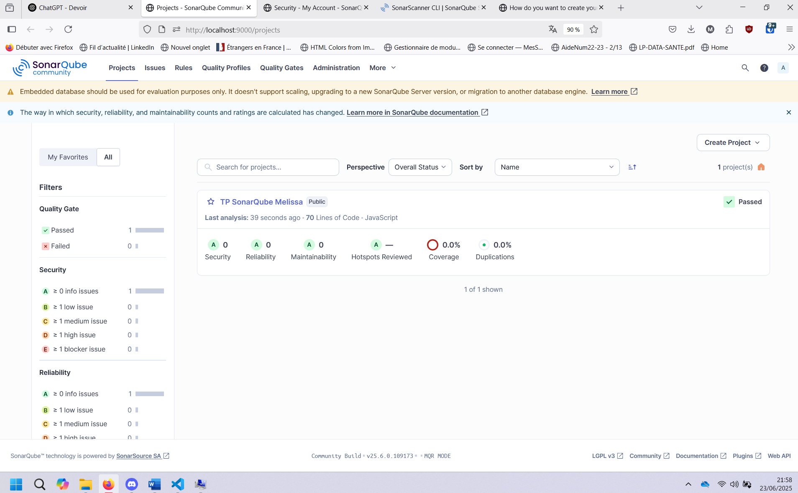

# Rapport – TP Qualité, Sécurité et Maintenabilité avec SonarQube

## Étape 1 – Analyse manuelle

| Fichier           | Type de problème | Ligne(s) | Description du problème                                     |
|-------------------|------------------|----------|-------------------------------------------------------------|
| userController.js | Bug              | Ligne 15 | Utilisation de `=` au lieu de `==` dans une condition       |
| userController.js | Sécurité         | Ligne 9  | Injection SQL possible avec valeurs non échappées          |
| auth.js           | Sécurité         | Ligne 8  | Mot de passe codé en dur dans le fichier                   |
| auth.js           | Code smell       | Ligne 8  | Absence de vérification de hachage de mot de passe         |
| utils.js          | Code smell       | Ligne 11 | Pas de gestion d'erreur centralisée                        |

## Étape 2 – Correction du code

- Refactorisation des fonctions `createUser`, `getUser`, `login`
- Mise en place de requêtes préparées (sécurité SQL)
- Hachage des mots de passe avec bcrypt
- Création d'une fonction `queryWithParams` dans `utils.js`
- Ajout de messages d’erreur clairs

## Étape 3 – Analyse avec SonarQube

- SonarQube installé en local (version 25.6)
- Analyse exécutée avec succès via SonarScanner 7.1
- Résultat : aucun bug détecté, code clean
- Capture ci-dessous :

## Étape 4 – GitHub 

- Projet disponible sur GitHub :  
  [https://github.com/melissabelkessam/tpsonarqube](https://github.com/melissabelkessam/tpsonarqube)
